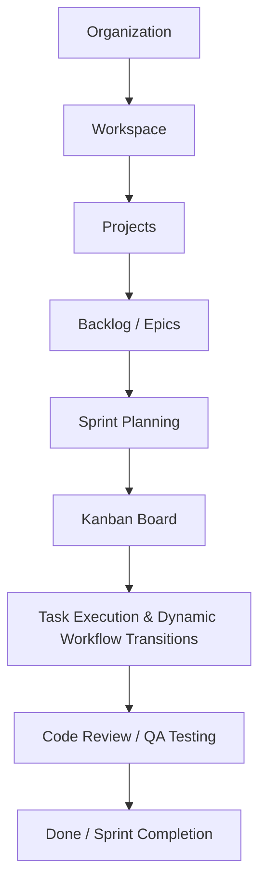

# 🚀 Tasks — Enterprise Agile Project & Workflow Management Platform

> Nền tảng quản lý dự án, quy trình làm việc Agile (Scrum / Kanban) và cộng tác thời gian thực chuẩn Enterprise, kết hợp sức mạnh quản trị của **Jira Software**, tính linh hoạt của **Linear** và mô hình quản trị của **Base.vn Software**.

---

## 📌 1. Mục Đích của Dự Án (Project Purpose)

Dự án **Tasks** được xây dựng nhằm giải quyết toàn diện bài toán quản lý dự án, tối ưu hóa năng suất làm việc và minh bạch hóa luồng công việc cho các doanh nghiệp, tổ chức và nhóm phát triển phần mềm hiện đại:

1. **Quản trị Toàn diện theo Mô hình Đa cấp (Multi-tier Enterprise Structure)**:
   - Tổ chức (**Organization**) ➔ Không gian làm việc (**Workspace**) ➔ Dự án (**Project**) ➔ Mục tiêu lớn (**Epics**) ➔ Chu kỳ (**Sprints**) ➔ Nhiệm vụ (**Tasks/Subtasks**).
2. **Quy trình Làm việc Linh hoạt & Tùy biến Động (Dynamic Custom Workflows)**:
   - Cho phép từng dự án tự định nghĩa các cột trạng thái (**Workflow Statuses**) và các quy tắc chuyển đổi hợp lệ (**Workflow Transitions**), tự động hiển thị sơ đồ luồng quy trình (**Workflow Visualizer**).
3. **Phân quyền Nghiệp vụ Chặt chẽ (Enterprise RBAC & Security)**:
   - Kết hợp phân quyền đa tầng: Quyền Quản trị Hệ thống (Admin), Trưởng dự án (Project Lead), Quản lý Workspace (Owner/Admin), và Thành viên dự án (Project Member) với xác thực **Laravel Passport OAuth2 (RS256 JWT)**.
4. **Cộng tác & Trao đổi Thời gian thực (Real-time Collaboration)**:
   - Đồng bộ bảng Kanban tức thì, kênh trao đổi tin nhắn dự án (**Project Chatbox**) với luồng trả lời (Threads), tệp đính kèm và thông báo đẩy qua **WebSockets (Laravel Reverb)**.
5. **Theo dõi Tiến độ & Quản lý Thời gian (Time Tracking & Audit Trail)**:
   - Ghi nhận nhật ký thời gian làm việc (**Worklogs**), danh sách kiểm tra (**Checklists**), biểu đồ tiến độ Sprint (**Burndown Chart**) và lịch sử thay đổi chi tiết (**Activity Logs**).

---

## 🛠️ 2. Ngăn Xếp Công Nghệ (Technology Stack)

Hệ thống được tổ chức theo kiến trúc **Monorepo** phân tách rõ ràng giữa Backend API và Frontend Web Client:

```
tasks/
├── apps/
│   ├── api/          # Backend Laravel 12 API + Filament v5 Admin + Laravel Passport
│   └── web/          # Frontend Next.js 15 (Turbopack, App Router) + Ant Design v5
├── .agents/          # Cấu hình AI Agent Workflows, Rules & Skills
└── graphify-out/     # Đồ thị Tri thức Codebase AST (Knowledge Graph 7,000+ nodes)
```

### 🔧 A. Backend Stack (`apps/api`)
- **Ngôn ngữ & Framework**: **PHP 8.3+**, **Laravel 12 / 13** (Kiến trúc RESTful API chuẩn).
- **Xác thực & Ủy quyền (Authentication & OAuth2)**:
  - **Laravel Passport 13**: Cấp phát và quản lý Personal Access Token & OAuth2 Client với chuẩn mã hóa RS256 JWT và hệ thống Scopes chi tiết (`read:profile`, `read:tasks`, `write:tasks`, `read:chat`, `write:chat`, `admin:all`).
- **Trung tâm Quản trị (Admin Panel)**:
  - **Filament v5**: Bảng điều khiển quản trị hiện đại, quản lý người dùng, tổ chức, workspace, dự án, công việc, tin nhắn, nhật ký audit và quản lý OAuth Tokens / OAuth Clients.
- **Phân quyền Vai trò (RBAC)**:
  - **Spatie Laravel Permission** & **Filament Shield**: Phân quyền chi tiết theo vai trò và quyền hạn (Super-admin, Admin, Lead, Member, Viewer).
- **Thời gian thực (WebSockets)**:
  - **Laravel Reverb 1.11**: WebSockets server hiệu năng cao, phát sự kiện real-time cho tin nhắn và trạng thái công việc.
- **Audit Logging & Tài liệu API**:
  - **Spatie Laravel Activitylog**: Lưu vết lịch sử thay đổi của toàn bộ thực thể.
  - **Dedoc Scramble**: Tự động sinh tài liệu Swagger / OpenAPI 3.0.
- **Cơ sở dữ liệu**: **PostgreSQL 16** (Môi trường phát triển & Production) / **SQLite** (In-memory testing).

---

### 🎨 B. Frontend Stack (`apps/web`)
- **Framework Core**: **Next.js 15.1.7** (App Router, Turbopack, SSR/CSR tối ưu).
- **Thư viện UI & Design System**:
  - **Ant Design v5.24**: Hệ thống Design System hoàn chỉnh, đồng bộ theme sáng/tối (**Dark/Light Mode**) mượt mà qua `<App>` Context và `AntdProvider`.
  - **Tailwind CSS 3.4**: Tiện ích styling linh hoạt.
  - **Ant Design Icons & Phosphor Icons**: Hệ thống biểu tượng giao diện phong phú.
- **Kéo thả & Tương tác Bảng (Drag & Drop)**:
  - **@dnd-kit/core** & **@dnd-kit/sortable**: Kéo thả thẻ task trên Kanban Board mượt mà, hỗ trợ pointer sensor và touch screen.
- **Quản lý Dữ liệu & State Management**:
  - **TanStack React Query v5**: Quản lý server state, auto refetching, caching và optimistic updates.
  - **Zustand v5**: Quản lý client state (Auth state, active workspace, UI drawer) có cơ chế hydration bảo vệ chống race-condition logout.
- **Kết nối Thời gian thực (Real-time Client)**:
  - **Laravel Echo** & **Pusher.js**: Lắng nghe kênh riêng tư (`private-project.{id}`, `private-user.{id}`) từ Reverb Server.
- **Trình soạn thảo & Biểu đồ**:
  - **TipTap Rich Text Editor**: Soạn thảo mô tả công việc, bình luận kèm tính năng **@mention**.
  - **Recharts**: Biểu đồ tiến độ, năng suất và phân bổ công việc.

---

## 🔥 3. Danh Sách & Mô Tả Chi Tiết Các Chức Năng Hiện Có (Core Features Breakdown)

### 💬 1. Hệ Thống Trò Chuyện Thời Gian Thực (Project Real-time Chatbox)
- **Kênh Thảo luận Riêng theo Dự án**: Mỗi dự án sở hữu một phòng chat tích hợp trực tiếp, giúp các thành viên trao đổi ngữ cảnh công việc liền mạch mà không cần chuyển sang ứng dụng bên ngoài.
- **WebSockets Live Broadcasting**: Sử dụng Laravel Reverb phát sóng tức thì sự kiện `ChatMessageSent` trên kênh riêng tư `private-project.{id}`.
- **Phản hồi Tin nhắn (Reply Threads) & Cuộn Mượt mà**: Người dùng có thể trả lời trực tiếp một tin nhắn cụ thể; nhấp vào trích dẫn sẽ tự động kích hoạt **smooth scroll** và hiệu ứng làm nổi bật (highlight flash) tới tin nhắn gốc.
- **Ghim Tin nhắn Quan trọng (Pin Message)**: Cho phép ghim các thông báo, tài liệu hoặc chỉ đạo quan trọng lên đầu hộp thoại.
- **Gửi Tệp Đính Kèm Đa Phương Tiện**: Hỗ trợ đính kèm hình ảnh, tài liệu (PDF, Word, Excel) với xem trước trực quan.
- **Chống Trùng lặp Khóa (Key Deduplication)**: Tối ưu thuật toán xử lý UI state, loại bỏ triệt để lỗi duplicate React key khi gửi và nhận tin nhắn đồng thời.
- **Kiểm Duyệt Tin nhắn trong Admin**: Quản trị viên có thể tra cứu, kiểm tra lịch sử chat và xử lý tin nhắn vi phạm qua `ProjectChatMessageResource`.

---

### 🔔 2. Hệ Thống Thông Báo Thời Gian Thực (Real-time Notification Engine)
- **Chuông Thông báo Thông minh**: Tích hợp trên thanh Header với huy hiệu đếm số lượng thông báo chưa đọc (Unread Badge Counter).
- **Phát sóng Tức thì qua WebSockets**: Thông báo được đẩy lập tức đến từng người dùng qua kênh cá nhân `private-user.{id}`.
- **Đa dạng Phân loại Thông báo**:
  - `task_assigned`: Thông báo khi được giao một nhiệm vụ mới.
  - `mention`: Thông báo khi có người nhắc tên (@mention) trong bình luận task hoặc tin nhắn chatbox.
  - `status_change`: Thông báo khi trạng thái task phụ trách hoặc theo dõi thay đổi.
  - `sprint_started` / `sprint_completed`: Thông báo khi chu kỳ Sprint bắt đầu hoặc kết thúc.
  - `due_soon`: Cảnh báo khi nhiệm vụ sắp đến hạn chót.
- **Tương tác Nhanh**: Hỗ trợ lọc theo tab *Tất cả / Chưa đọc*, nút "Đánh dấu đã đọc tất cả", và nhấp vào thông báo để điều hướng trực tiếp đến Task hoặc Dự án tương ứng.
- **Quản lý Thông báo Admin**: Tra cứu, lọc theo loại sự kiện và kiểm tra trạng thái gửi thông báo qua `NotificationResource`.

---

### ⏱️ 3. Quản Lý Nhiệm Vụ & Ghi Nhận Thời Gian Làm Việc (Task Tracking & Worklogs)
- **Hộp thoại Chi Tiết Nhiệm Vụ Toàn diện (Task Detail Modal 1000px Centered)**:
  - **Tab Chi tiết**: Tiêu đề, mô tả phong phú (Rich Text), Loại task (Story/Task/Bug/Subtask), Độ ưu tiên, Người thực hiện (Assignee), Người tạo (Reporter), Người kiểm thử (Tester), Ngày hết hạn (Due Date), Nhãn (Labels).
  - **Tab Checklist**: Tạo danh sách các đầu mục kiểm tra nhỏ; thanh tiến độ phần trăm tự động tính toán khi tick chọn hoàn thành.
  - **Tab Ghi nhận Thời gian (Worklogs)**: Cho phép thành viên nhập số phút/giờ thực tế đã làm việc kèm mô tả chi tiết; hệ thống tự động cộng dồn và so sánh tỷ lệ giữa Thời gian đã dùng (**Spent Time**) và Thời gian ước tính (**Estimated Time**).
  - **Tab Bình luận (Comments)**: Soạn thảo bình luận hỗ trợ định dạng code, trích dẫn và **@mention** thành viên dự án.
  - **Tab Tệp đính kèm (Attachments)**: Tải lên, xem trước và tải về các tài liệu liên quan đến task.
  - **Tab Lịch sử Hoạt động (Activity Timeline)**: Ghi lại từng thay đổi trạng thái, người cập nhật và thời gian chính xác.
- **Kiểm toán Bình luận & Worklogs Admin**: Quản trị viên có thể theo dõi và kiểm toán toàn bộ nhật ký thời gian làm việc trên toàn hệ thống qua `TaskWorkLogResource` và `TaskCommentResource`.

---

### 📊 4. Quản Lý Chu Kỳ Agile / Scrum & Backlog
- **Quản lý Backlog Grooming**: Gom nhóm các yêu cầu chưa phân bổ, sắp xếp thứ tự ưu tiên bằng kéo thả, ước tính khối lượng công việc (Story Points / Estimate Hours).
- **Lập Kế hoạch Sprint (Sprint Planning)**: Tạo Sprint mới, đặt tên, mục tiêu (**Sprint Goal**), ngày bắt đầu và kết thúc dự kiến.
- **Kích hoạt & Chuyển giao Sprint**:
  - **Bắt đầu Sprint (Start Sprint)**: Đưa các công việc trong kế hoạch vào Bảng Kanban đang diễn ra.
  - **Hoàn thành Sprint (Complete Sprint)**: Đánh giá tỷ lệ hoàn thành, tự động chuyển các công việc còn dở dang về Backlog hoặc gối đầu sang Sprint kế tiếp.
- **Bộ chuyển đổi Sprint nhanh (Sprint Switcher)**: Chuyển đổi linh hoạt giữa các Sprint đang chạy, Sprint kế hoạch và Backlog ngay trên thanh tiêu đề Board.

---

### 🎛️ 5. Bảng Kanban & Tùy Biến Quy Trình Động (Kanban Board & Custom Workflows)
- **Kéo Thả Trực Quan (@dnd-kit)**: Di chuyển thẻ nhiệm vụ giữa các cột trạng thái mượt mà, phản hồi ngay lập tức (Optimistic Update) và đồng bộ về máy chủ.
- **Modal Thiết Lập Quy Trình (`ProjectWorkflowModal`)**:
  - **Cột Trạng Thái (Workflow Statuses)**: Thêm cột mới (vd: *Code Review*, *QA Testing*, *Staging*), chỉnh sửa tên, phân loại danh mục tiến độ (`todo`, `in_progress`, `done`, `cancelled`), chọn bảng màu sắc trực quan (Slate, Blue, Indigo, Violet, Emerald, Amber, Red), và thay đổi thứ tự cột.
  - **Quy Tắc Chuyển Đổi (Workflow Transitions)**: Cấu hình các đường chuyển hợp lệ giữa các cột khi kéo thả task (ví dụ: chỉ cho phép từ *In Progress* ➔ *Code Review* ➔ *Done*).
  - **Sơ Đồ Luồng Tuần Tự (Workflow Visualizer)**: Hiển thị trực quan sơ đồ Node Flow từng bước của quy trình dự án.
  - **Phân Quyền Thao Tác Chặt Chẽ**: Chỉ tài khoản Admin hệ thống, Trưởng dự án (Project Lead) hoặc Quản lý dự án mới hiển thị nút bấm và có quyền thao tác trên Workflow.

---

### 🔍 6. Thanh Bộ Lọc Bảng Đa Tiêu Chí (Advanced Board Filter Bar)
- **Tìm kiếm Văn bản Nhanh**: Tìm theo từ khóa trong tiêu đề task hoặc mã định danh task (ví dụ: `CORE-12`).
- **Lọc theo Độ Ưu Tiên**: Lọc tức thì theo `Critical`, `High`, `Medium`, `Low`, `None`.
- **Lọc theo Cột Trạng Thái**: Thu gọn hiển thị theo cột mong muốn.
- **Lọc theo Người Thực Hiện & Người Kiểm Thử**: Chọn xem các task được giao cho một hoặc nhiều thành viên cụ thể.
- **Nút Xóa Bộ Lọc Nhanh (Clear Filters)**: Đưa bảng về trạng thái hiển thị mặc định chỉ với một cú nhấp chuột.

---

### 🏢 7. Quản Lý Đa Không Gian & Tổ Chức (Workspaces & Organizations)
- **Hỗ trợ Đa Tổ Chức & Không Gian Làm Việc**: Một người dùng có thể tạo hoặc tham gia nhiều Workspace độc lập.
- **Bộ chuyển đổi Workspace (WorkspaceSwitcher)**: Chuyển đổi nhanh giữa các Workspace từ Sidebar mà không bị gián đoạn phiên làm việc.
- **Phân quyền Thành viên trong Workspace & Project**: Quản lý các vai trò `Owner`, `Admin`, `Member`, `Viewer` với quyền hạn truy cập tương ứng.

---

### 👤 8. Quản Lý Hồ Sơ Cá Nhân & Bảo Mật (User Profile & Security Settings)
- **Cập nhật Hồ sơ**: Thay đổi Tên hiển thị, Email, Tên đăng nhập (Username), và Ảnh đại diện (Avatar).
- **Đổi Mật khẩu An toàn**: Xác thực mật khẩu hiện tại trước khi cập nhật mật khẩu mới, kiểm tra độ dài và độ phức tạp.

---

### 🔑 9. Quản Lý Token OAuth2 & Clients (Laravel Passport trong Filament Admin)
- **Quản lý Access Tokens (`OAuthTokenResource`)**:
  - Xem danh sách toàn bộ Access Token của hệ thống: Mã ID token, Người sở hữu, Tên token, Danh sách Scopes (dạng Badges), Trạng thái (🟢 *Active* / 🔴 *Revoked* / ⚪ *Expired*), Ngày tạo và Ngày hết hạn.
  - **Cấp Token Mới (Issue Token)**: Cho phép Admin chọn User, nhập tên token, tick chọn Scopes (`read:profile`, `read:tasks`, `write:tasks`, `read:chat`, `write:chat`, `admin:all`) và thời hạn sử dụng (30 ngày, 90 ngày, 1 năm hoặc Không thời hạn).
  - **Thu Hồi & Khôi Phục (Revoke / Activate)**: Vô hiệu hóa hoặc mở lại token lập tức với hộp thoại xác nhận.
- **Quản lý OAuth Clients (`OAuthClientResource`)**:
  - Quản lý danh sách Client (Authorization Code, Password Grant, Personal Access Client).
  - Tạo mới Client và Tái tạo Secret (**Regenerate Secret**) an toàn kèm cảnh báo sao chép.

---

### 🛡️ 10. Trung Tâm Quản Trị Hệ Thống Toàn Diện (Filament Admin Portal — 14 Resources)
Bảng điều khiển quản trị `/admin` được xây dựng đầy đủ các module:
1. **Users**: Quản lý tài khoản, vai trò, trạng thái kích hoạt.
2. **Organizations**: Quản lý tổ chức và thông tin doanh nghiệp.
3. **Workspaces**: Quản lý không gian làm việc và thành viên.
4. **Projects**: Quản lý dự án, Project Lead, workflow liên kết.
5. **Workflows**: Quản lý quy trình chuẩn mẫu toàn hệ thống.
6. **Tasks**: Tra cứu và quản trị toàn bộ nhiệm vụ.
7. **Sprints**: Quản lý chu kỳ phát triển của các dự án.
8. **Epics**: Quản lý các mục tiêu lớn (Epics) của dự án.
9. **Labels**: Quản lý nhãn công việc.
10. **Media**: Quản lý toàn bộ tệp đính kèm và tài liệu tải lên.
11. **Project Chat Messages**: Kiểm duyệt và tra cứu tin nhắn chatbox.
12. **Notifications**: Kiểm toán và theo dõi thông báo người dùng.
13. **Task Comments**: Quản lý và kiểm duyệt bình luận.
14. **Task Work Logs**: Kiểm toán thời gian làm việc của nhân sự trên toàn hệ thống.
15. **OAuth Tokens & OAuth Clients**: Quản lý bảo mật kết nối API và ứng dụng bên thứ ba.
16. **Activity Logs**: Nhật ký audit toàn bộ hoạt động trong hệ thống.
17. **Shield Roles & Permissions**: Quản trị phân quyền chi tiết của hệ thống.

---

## 🔄 4. Sơ Đồ Luồng Nghiệp Vụ Cốt Lõi (Core Workflows)



---

## 🚀 5. Hướng Dẫn Cài Đặt & Chạy Dự Án (Installation & Setup)

### Yêu Cầu Môi Trường
- **PHP**: `>= 8.3`
- **Node.js**: `>= 20.x` & **npm** `>= 10.x`
- **Composer**: `>= 2.7`
- **PostgreSQL**: `>= 16` (hoặc SQLite)

---

### Bước 1: Cài đặt Backend (`apps/api`)

```bash
cd apps/api

# 1. Cài đặt các gói phụ thuộc PHP
composer install

# 2. Cấu hình file môi trường
cp .env.example .env
php artisan key:generate

# 3. Chạy Migration và nạp dữ liệu mẫu
php artisan migrate --seed

# 4. Khởi tạo khóa mã hóa Passport và Personal Access Client
php artisan passport:keys
php artisan passport:client --personal --name="Tasks Personal Access Client"

# 5. Khởi chạy Server API & WebSockets Reverb
php artisan serve --port=8000
# Trong terminal khác (chạy WebSockets):
php artisan reverb:start
```

---

### Bước 2: Cài đặt Frontend (`apps/web`)

```bash
cd apps/web

# 1. Cài đặt các gói phụ thuộc Node.js
npm install

# 2. Cấu hình file môi trường (.env.local)
# NEXT_PUBLIC_API_URL=http://localhost:8000/api/v1
# NEXT_PUBLIC_REVERB_APP_KEY=tasks-reverb-key
# NEXT_PUBLIC_REVERB_HOST=localhost
# NEXT_PUBLIC_REVERB_PORT=8080

# 3. Khởi chạy Web Client ở chế độ Development
npm run dev
```

Mở trình duyệt truy cập:
- **Web App Client**: `http://localhost:3000`
- **Admin Management Panel**: `http://localhost:8000/admin`
- **API Documentation**: `http://localhost:8000/docs/api`

---

### 🔑 Tài Khoản Mặc Định (Default Credentials)

| Vai trò | Email / Username | Mật khẩu | Quyền hạn |
| :--- | :--- | :--- | :--- |
| **System Admin** | `admin@tasks.local` | `password` | Toàn quyền Quản trị Hệ thống & Filament Admin |
| **Project Lead** | `lead@tasks.local` | `password` | Quản lý Dự án, Sprint và Thiết lập Workflow |
| **Member** | `developer@tasks.local` | `password` | Thực hiện Task, Logging time, Chatbox |

---

## 🧪 6. Kiểm Thử & Đảm Bảo Chất Lượng (Quality Assurance)

Dự án áp dụng quy chuẩn kiểm thử nghiêm ngặt theo phương pháp **Test-Driven Development (TDD)** và nguyên tắc **Clean Code (Robert C. Martin)**:

```bash
# 1. Chạy toàn bộ Test Suite Backend (PHPUnit)
cd apps/api
php artisan test

# 2. Kiểm tra tính toàn vẹn kiểu dữ liệu Frontend (TypeScript)
cd apps/web
npx tsc --noEmit

# 3. Cập nhật Đồ thị Tri thức Codebase (Graphify AST Knowledge Graph)
cd ../..
python -m graphify update .
```

- **Kết quả Kiểm thử Backend**: **58 / 58 tests passed** (167 assertions, 100% Passed).
- **Kết quả Kiểm thử Admin Panel**: **22 / 22 tests passed** (28 assertions, 100% Passed).
- **TypeScript Typecheck**: **0 lỗi biên dịch**.

---

## 📄 License
Phát triển và phân phối dưới giấy phép [MIT License](LICENSE).
