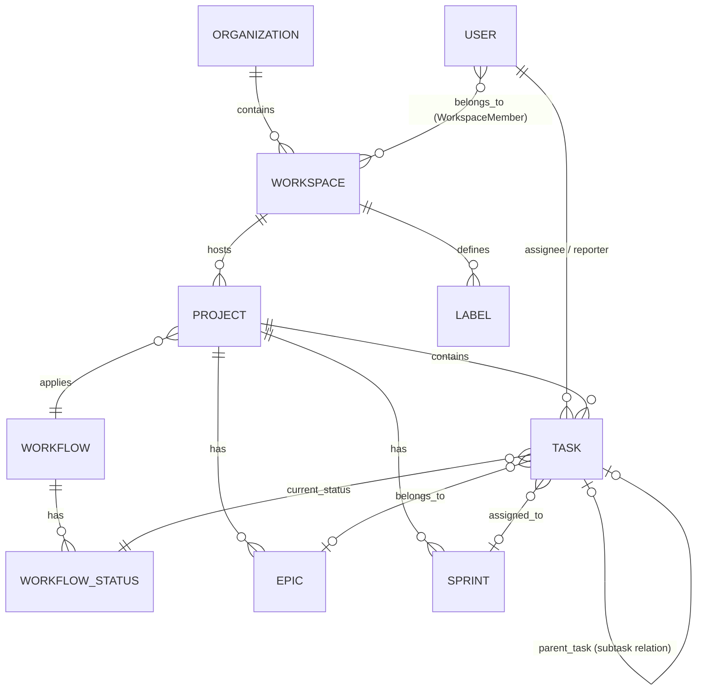

# Admin & Project Workflow Operations Manual

Tài liệu này hướng dẫn chi tiết quy trình thiết lập (Workflow) và vận hành hệ thống quản lý dự án thông qua **Laravel Filament Admin Console** (dành cho Admin) và luồng hoạt động của **Project & Task Engine** (dành cho người dùng).

---

## 1. Luồng thiết lập hệ thống cho Admin (Admin Workflow)

Admin có nhiệm vụ thiết lập hạ tầng Tenant (Multi-tenant), phân quyền và cấu hình mẫu quy trình (Workflow Templates) trước khi chuyển giao cho người dùng.

### Bước 1: Quản lý Tổ chức (Organizations) & Workspace
Hệ thống scope dữ liệu theo mô hình Multi-tenant & Multi-workspace:
1. **Tạo Tổ chức (Organization):**
   - Admin truy cập `OrganizationResource` để tạo tổ chức mới.
   - Nhập `Name` (ví dụ: `Tasks Corp`), `Slug` (tự động tạo: `tasks-corp`), và `Domain` (ví dụ: `tasks.local`).
2. **Tạo Workspace:**
   - Mỗi tổ chức chứa nhiều workspace. Admin truy cập `WorkspaceResource` để tạo Workspace (ví dụ: `Main Workspace`).
   - Workspace bắt buộc phải liên kết với một `Organization`. Dữ liệu các dự án, công việc sau này sẽ được cô lập hoàn toàn (scoped) theo từng Workspace.

### Bước 2: Quản lý Người dùng (Users) & Phân quyền (RBAC)
1. **Tạo tài khoản người dùng:**
   - Admin truy cập `UserResource` để quản lý người dùng hệ thống.
   - Điền thông tin `Name`, `Email`, `Password`, và trạng thái `is_active`.
2. **Gán vai trò hệ thống (Spatie Roles):**
   - Người dùng được gán các vai trò toàn hệ thống:
     - `super-admin`: Toàn quyền quản trị hệ thống Filament Admin.
     - `workspace-admin`: Admin quản lý Workspace cụ thể.
     - `project-manager`: Quản lý các dự án và phân công công việc.
     - `member`: Thành viên tham gia thực thi công việc.
     - `guest`: Khách xem báo cáo/tiến độ công việc.
3. **Workspace Member (Thành viên Workspace):**
   - Chỉ định thành viên vào các Workspace tương ứng để họ có quyền truy cập dữ liệu cô lập của Workspace đó.

### Bước 3: Cấu hình Mẫu Quy trình (Workflow Templates)
Hệ thống sử dụng **Quy trình Động (Dynamic Workflow Engine)** để kiểm soát các trạng thái chuyển đổi của Task.
1. **Tạo Workflow Template:**
   - Admin truy cập `WorkflowResource` để tạo mẫu quy trình chung (ví dụ: `Software Development Workflow`).
2. **Định nghĩa các Trạng thái (Workflow Statuses):**
   - Với mỗi Workflow, Admin thêm các Status tương ứng:
     - **To Do** (Category: `todo`) - Công việc mới được tạo.
     - **In Progress** (Category: `in_progress`) - Đang thực hiện.
     - **In Review** (Category: `in_progress`) - Đang đánh giá.
     - **Done** (Category: `done`) - Đã hoàn thành.
3. **Cấu hình chuyển đổi trạng thái (Transitions - Sắp phát triển):**
   - Định nghĩa quy tắc di chuyển task (ví dụ: Chỉ cho phép chuyển từ `In Review` sang `Done` nếu người thao tác là `project-manager`).

---

## 2. Luồng hoạt động Dự án & Công việc (Project & Task Workflow)

Sau khi Admin hoàn tất cấu hình cơ bản, luồng vận hành dự án sẽ do các Project Manager và Member thực hiện.

### Bước 1: Tạo Dự án (Project Setup)
1. PM hoặc Admin tạo dự án mới thông qua `ProjectResource` (hoặc Client App sau này).
2. Thiết lập thông tin:
   - `Name` (Tên dự án).
   - `Key` (Mã viết tắt dự án, ví dụ: `PROJ` -> phục vụ sinh Task Number tự động như `PROJ-1`, `PROJ-2`).
   - `Workflow`: Chọn một mẫu quy trình động đã cấu hình ở phần Admin (ví dụ: `Software Development Workflow`).
   - `Lead`: Gán người quản trị dự án.
   - `Start Date` & `Target End Date` để lên kế hoạch.

### Bước 2: Thiết lập Epics & Sprints (Agile Planning)
1. **Epic (Sử thi):**
   - PM tạo Epic để gom nhóm các tính năng hoặc module lớn trong dự án (ví dụ: `Epic: User Authentication`).
2. **Sprint (Chu kỳ):**
   - PM tạo Sprint thông qua `SprintResource` để lên kế hoạch cho từng chu kỳ làm việc (thường từ 1-4 tuần).
   - Sprint có trạng thái: `future` (chuẩn bị), `active` (đang chạy), `completed` (đã đóng).

### Bước 3: Vận hành Công việc (Task Lifecycle)
Task (Công việc) là đơn vị nhỏ nhất và tuân thủ chặt chẽ theo Workflow đã chọn của dự án.

1. **Tạo Task:**
   - Điền tiêu đề (`title`), nội dung mô tả (`description`), chọn `type` (`task`, `bug`, `story`, `subtask`).
   - Gán dự án (`project_id`) -> Hệ thống tự động sinh `task_number` (ví dụ: `PROJ-25`).
   - Gán `epic_id` và `sprint_id` để đưa vào kế hoạch Sprint.
   - Chọn `reporter` (người báo cáo) và `assignee` (người thực hiện).
2. **Chuyển đổi Trạng thái Task (Task Transition):**
   - Khi công việc tiến triển, Task sẽ chuyển dịch qua các trạng thái (ví dụ: `To Do` -> `In Progress`).
   - Quá trình này được kiểm soát bởi `WorkflowTransitionService` trên Backend để đảm bảo:
     - Trạng thái đích phải thuộc Workflow của dự án.
     - Người dùng có đủ vai trò cho phép để thực hiện dịch chuyển.
3. **Theo dõi và Ghi nhận (Activity Log):**
   - Mọi thay đổi trên Task (thay đổi người thực hiện, cập nhật trạng thái, chỉnh sửa nội dung) đều tự động ghi lại lịch sử thông qua `ActivityLogResource` để phục vụ audit.

---

## 3. Bản đồ Mối quan hệ Dữ liệu (Entity Relationship Map)

Sơ đồ dưới đây minh họa mối quan hệ phân cấp giữa các thực thể trong hệ thống:

---

## 4. Danh sách các tài nguyên Filament đã hoàn thành

Hệ thống quản lý Admin hiện tại đã cài đặt đầy đủ các Resource cho phép Admin thao tác:
1. `UserResource`: Quản lý tài khoản và vai trò.
2. `OrganizationResource`: Quản lý Tenant/Tổ chức.
3. `WorkspaceResource`: Quản lý không gian làm việc.
4. `WorkflowResource`: Quản lý quy trình và các trạng thái động.
5. `ProjectResource`: Quản lý dự án, workflow liên kết, và thông tin chung.
6. `TaskResource`: Quản lý công việc, subtask, phân công, trạng thái.
7. `SprintResource`: Quản lý Sprint và chu kỳ.
8. `EpicResource`: Quản lý Epic phân rã dự án.
9. `LabelResource`: Quản lý nhãn phân loại màu sắc.
10. `ActivityLogResource`: Nhật ký theo dõi hoạt động toàn hệ thống.
